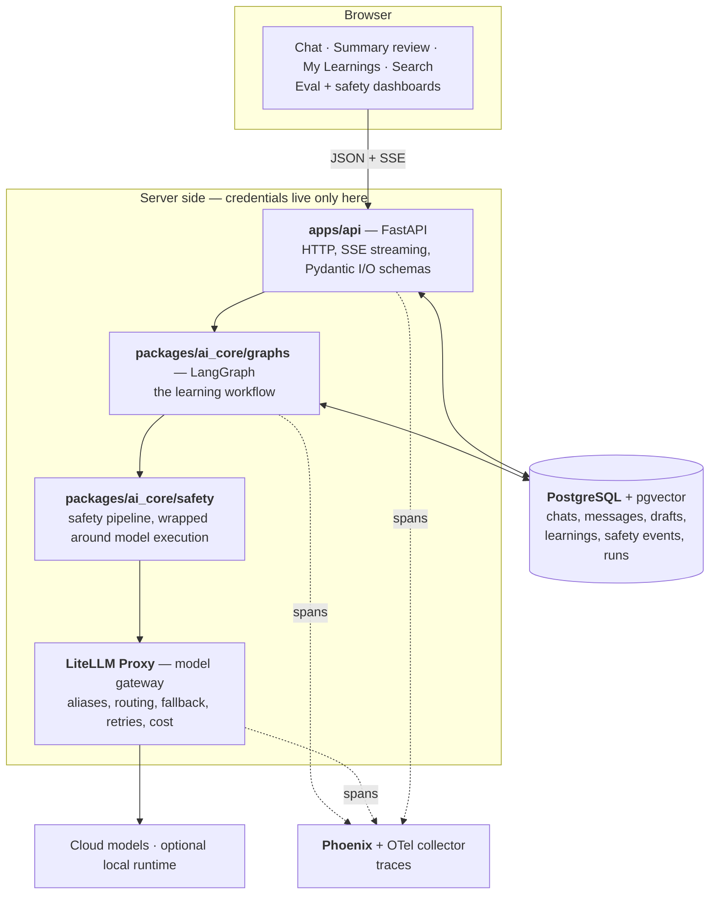

# Architecture

The overall shape of LearnTrail: what the layers are, how a request moves through
them, who owns what, and which parts exist today.

This is a **map, not a status report**. Every component below is marked with the
phase that introduces it, because most of them do not exist yet. For what is
actually built, run:

```bash
make status
```

Full requirements and rationale live in [SPEC.md](SPEC.md); this file is the
condensed structural view. The cross-phase rules that constrain every box below
are in [../CLAUDE.md](../CLAUDE.md) — read those first, they explain several
choices that otherwise look arbitrary.

Legend: **built** · *planned (Phase N)*

---

## 1. The four things that shape this architecture

Design decisions here follow from constraints, not taste:

1. **No auth, no users.** Single-user by construction — no `user` table, no
   `user_id` column, no session layer, no tenant scoping anywhere. This removes an
   entire axis from every schema and endpoint.
2. **Provider credentials never leave the server.** The browser talks only to
   FastAPI; FastAPI talks to models only through the LiteLLM gateway. There is no
   code path from the frontend to a model API.
3. **Every model call goes through an alias** (`learning-fast`, `learning-deep`,
   `safety-judge`) — never a provider/model string. Swapping a provider is a
   gateway config change, not an application change.
4. **The model drafts; only a human promotes.** Nothing becomes an approved
   Learning without an explicit human approval action. This is why the write path
   for knowledge is split in two — draft storage and approved storage are
   different tables with different rules.

Python owns the AI application layer (the orchestration, safety, evaluation and
retrieval ecosystems are Python-first). TypeScript owns the browser.

---

## 2. Runtime architecture



Reading the diagram:

- **Solid edges are the request path**; dotted edges are telemetry, which never
  affects a response.
- **The `server` box is the credential boundary.** Everything inside it is
  server-side only. The browser has no route to `gateway` or `models`.
- **The graph owns the request, not the endpoint.** From Phase 2 on, the FastAPI
  handler validates, calls the graph, and streams what comes back. Business logic
  lives in nodes so it is inspectable and replayable, not in the route.
- **Safety sits around model execution, not beside it.** In practice its checks
  are graph nodes before and after `generate_answer`, so a blocked request is a
  normal graph path rather than an exception.

### Layer entry by phase

| Layer | Enters | Status |
|---|---|---|
| PostgreSQL, backend, frontend containers | Phase 0 | **built** |
| FastAPI app object, empty SQLAlchemy metadata, Alembic env | Phase 0 | **built** |
| LiteLLM gateway + first cloud model + chat/message tables | Phase 1 | *planned* |
| LangGraph workflow + Postgres checkpointer | Phase 2 | *planned* |
| Structured summary drafts + approval (Pydantic AI) | Phase 3 | *planned* |
| Safety pipeline (NeMo Guardrails, Guardrails AI) | Phase 4 | *planned* |
| OTel + Phoenix tracing | Phase 5 | *planned* |
| Evaluation (DeepEval, Promptfoo, Ragas) | Phase 6 | *planned* |
| Red teaming | Phase 7 | *planned* |
| Retrieval / pgvector search (LlamaIndex) | Phase 8 | *planned* |
| Prompt optimization (DSPy) | Phase 9 | *planned* |
| Model routing | Phase 10 | *planned* |
| Local model runtime | Phase 11 | *planned* |

A framework never arrives early. One new AI concept per phase is a hard rule, so
"we'll need it eventually" is not a reason to add a dependency now.

---

## 3. The request path

### Chat request — end state

```text
POST /chats/{id}/messages
        │
        ▼
FastAPI: validate body (Pydantic), open SSE stream
        │
        ▼
LangGraph invocation, checkpointed per chat thread
        │
        ├─ validate_input ──── size/format, injection + jailbreak checks,
        │                      content classification, PII/secret detection
        ├─ build_context ───── working context: which messages and which
        │                      approved learnings to send (see §6)
        ├─ choose_model ────── pick an alias: learning-fast vs learning-deep
        ├─ generate_answer ─── LiteLLM call, tokens streamed back through SSE
        ├─ output_checks ───── structured-output validation, content check,
        │                      policy + quality checks
        └─ persist ─────────── message rows, model_run metadata, safety_events
        │
        ▼
Stream ends. Nothing here creates an approved Learning.
```

The path degrades gracefully backwards: in **Phase 1** it is a direct LiteLLM call
from the endpoint with no graph; Phase 2 replaces that call with the graph;
Phase 4 fills in the real safety nodes. Each phase substitutes a real
implementation for a simpler one at the same seam.

### Learning approval — the human gate

```text
Chat ──▶ summary graph ──▶ summary_draft (validated, unapproved)
                                  │
                        interrupt: user reviews
                                  │
        ┌──────────┬──────────────┼─────────────┐
        ▼          ▼              ▼             ▼
     approve     edit         regenerate     reject
        │          │
        ▼          ▼
     learning + learning_revision  (the only durable knowledge)
```

`summary_draft` and `learning` are separate tables on purpose. A draft is model
output; a learning is human-approved knowledge. No code path promotes a draft
without an explicit approval action, and every change to an approved learning
writes a `learning_revision` so the history is auditable.

---

## 4. Process view — docker-compose

One compose file, one service per concern. A service joins compose in the phase
that introduces its concept, so this file grows over time.

| Service | Image / build | Host port | Phase | Status |
|---|---|---|---|---|
| `postgres` | `postgres:18-alpine` | 5432 | 0 | **built** |
| `backend` | `infra/docker/backend.Dockerfile` | 8000 | 0 | **built** |
| `frontend` | `infra/docker/frontend.Dockerfile` | 3000 | 0 | **built** |
| `litellm` | LiteLLM Proxy | — | 1 | *planned* |
| `phoenix` + OTel collector | Phoenix | — | 5 | *planned* |
| local model runtime | optional | — | 11 | *planned* |

Every service declares a healthcheck. That is not a convention — it is the
Phase 0 exit criterion, asserted by
[tests/phases/test_phase_0.py](../tests/phases/test_phase_0.py), which compares
the service list by **set equality**. Adding a service means updating that test
in the same commit.

Both current images are **development** images: the backend runs uvicorn
`--reload` over bind-mounted source, the frontend runs `next dev`. Production
build stages land when there is something to deploy. Driven by `make up`,
`make down`, `make logs`, `make ps`.

---

## 5. Data model

No `user` table, no `user_id` column, in any of these.

```text
conversation        chat, message
drafting            summary_draft
knowledge           learning, learning_revision, tag, learning_tag
governance          safety_event, model_run, prompt_version
evaluation          evaluation_case, evaluation_result
```

Four groups worth understanding as groups:

- **conversation** — raw history, the durable record of what was asked.
- **drafting → knowledge** — the approval boundary described in §3.
- **governance** — why the system did what it did. `safety_event` records each
  safety decision (stage, policy, version, action, severity) separately from the
  message it judged, so blocking decisions are auditable without mutating
  content. `model_run` records what was actually called. `prompt_version` carries
  prompts through `draft → candidate → active → retired`.
- **evaluation** — the test set and its results, so prompt and model changes are
  measured rather than eyeballed.

Currently the schema is **empty**: `packages/database` defines `Base` with a
constraint naming convention and zero tables, and Alembic has zero revisions.
`chat` and `message` arrive in Phase 1.

---

## 6. Conversation memory

Three distinct layers, deliberately not collapsed into one:

| Layer | Where it lives | Rule |
|---|---|---|
| Raw conversation | `chat` / `message` in Postgres | Everything, kept |
| Working context | Assembled per request by `build_context` | A *subset* chosen per request — full history, a recent window, previous-summary-plus-recent, or relevance-selected |
| Approved long-term memory | `learning` | Only approved learnings count as durable knowledge |

The important negative: **messages do not become long-term memory by
accumulating.** Only the human approval gate creates durable knowledge. Working
context is a per-request decision, not a growing blob.

---

## 7. Repository map

```text
apps/
  web/                  Next.js + React + TS — browser only          built
  api/                  FastAPI — HTTP, SSE, request/response schemas built (no routes)
packages/
  ai_core/              the AI application layer
    graphs/             LangGraph workflows                          Phase 2
    agents/             Pydantic AI typed components                 Phase 3
    schemas/            Pydantic schemas for model output            Phase 1+
    models/             LiteLLM client + alias definitions           Phase 1
    safety/             the safety pipeline                          Phase 4
    telemetry/          OTel setup                                   Phase 5
    retrieval/          LlamaIndex / pgvector search                  Phase 8
  evals/                datasets, metrics, judges, red_team, reports  Phase 6
  database/             SQLAlchemy metadata + Alembic                built (0 tables)
prompts/                prompt text, lifecycle-managed content        Phase 1
infra/
  docker/               Dockerfiles                                  built
  litellm/              gateway + alias config                       Phase 1
  phoenix/, otel/       tracing config                               Phase 5
tests/
  phases/               executable exit criteria, one per phase      built
  unit/, integration/, ai/, safety/, end_to_end/                     as needed
docker-compose.yml                                                   built
```

Two layout details that look like mistakes and are not:

- **`prompts/` is top-level, and `packages/ai_core/prompts/` deliberately does not
  exist.** Prompt text is lifecycle-managed *content*, loaded as files and
  versioned through `prompt_version` — not Python source to import.
- **Tests have four homes with a rule for each**, written down in
  [../CLAUDE.md](../CLAUDE.md). `tests/phases/` holds exit criteria and nothing
  else; a test naming a single workspace member belongs in that member's own
  `tests/`.

### Dependency direction

```text
apps/web  ──HTTP──▶  apps/api  ──▶  packages/ai_core  ──▶  packages/database
```

Arrows point one way. `packages/database` imports nothing from `ai_core` or
`api`; `ai_core` does not import `api`. This is enforceable rather than
aspirational — import-linter contracts land in Phase 1, so a violation fails a
check instead of surviving review.

---

## 8. What exists today

Phase 0 only, and Phase 0 is complete:

- Three healthy containers — Postgres, a FastAPI app with **no routes**, a static
  Next.js page. `make up` blocks until all three report healthy.
- `packages/database`: empty metadata, a runnable Alembic env, zero revisions.
- Toolchain: uv + Ruff + mypy strict + Pydantic plugin (Python), pnpm + Biome +
  type-aware ESLint + `tsc --strict` (TypeScript), lefthook hooks, `make fast`.
- 13 phase tests, of which Phase 0's is real and green and 12 are intentionally
  failing placeholders.

There is **no model call anywhere in this repo yet**, no `.env`, no LiteLLM, no
graph, no tables, and no CI. Phase 1 is where the system first talks to a model.

---

Written by a model, from [SPEC.md](SPEC.md) and the state of the tree. The phase
markers are claims about intent; `make status` is the only claim about reality.
