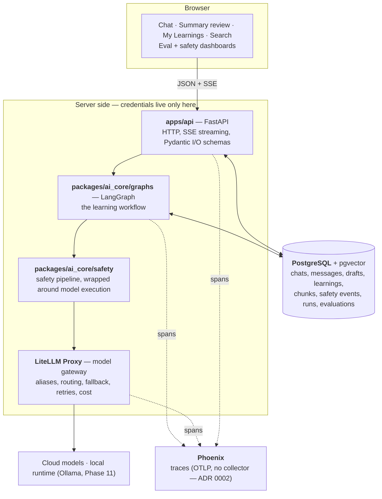

# Architecture

The overall shape of LearnTrail: what the layers are, how a request moves through
them, who owns what, and which parts exist today.

This is a **map, not a status report**. The 13-phase roadmap (0–12) is complete,
so every component below is built — but the phase that introduced each is kept in
the margin, because the shape of the system is easier to read as the order it grew
in. Markers are claims about intent; the only claim about reality is:

```bash
make status
```

Full requirements and rationale live in [SPEC.md](SPEC.md); this file is the
condensed structural view. The cross-phase rules that constrain every box below
are in [../CLAUDE.md](../CLAUDE.md) — read those first, they explain several
choices that otherwise look arbitrary.

Legend: **built** — everything here is, as of Phase 12.

---

## 1. The four things that shape this architecture

Design decisions here follow from constraints, not taste:

1. **No auth, no users.** Single-user by construction — no `user` table, no
   `user_id` column, no session layer, no tenant scoping anywhere. This removes an
   entire axis from every schema and endpoint.
2. **Provider credentials never leave the server.** The browser talks only to
   FastAPI; FastAPI talks to models only through the LiteLLM gateway. There is no
   code path from the frontend to a model API.
3. **Every model call goes through an alias** (`learning-fast`, `learning-deep`,
   `safety-judge`, `learning-embedding`, `learning-local`) — never a
   provider/model string. Swapping a provider, or moving a role to a local model,
   is a gateway config change, not an application change. This is what let model
   routing (Phase 10) and a local model (Phase 11) drop in without touching
   application code.
4. **The model drafts; only a human promotes.** Nothing becomes an approved
   Learning without an explicit human approval action. This is why the write path
   for knowledge is split in two — draft storage and approved storage are
   different tables with different rules.

Python owns the AI application layer (the orchestration, safety, evaluation and
retrieval ecosystems are Python-first). TypeScript owns the browser.

---

## 2. Runtime architecture



Reading the diagram:

- **Solid edges are the request path**; dotted edges are telemetry, which never
  affects a response.
- **The `server` box is the credential boundary.** Everything inside it is
  server-side only. The browser has no route to `gateway` or `models`.
- **The graph owns the request, not the endpoint.** From Phase 2 on, the FastAPI
  handler validates, calls the graph, and streams what comes back. Business logic
  lives in nodes so it is inspectable and replayable, not in the route.
- **Safety sits around model execution, not beside it.** In practice its checks
  are graph nodes before and after `generate_answer`, so a blocked request is a
  normal graph path rather than an exception.

### Layer entry by phase

| Layer | Enters | Status |
|---|---|---|
| PostgreSQL, backend, frontend containers | Phase 0 | **built** |
| FastAPI app object, empty SQLAlchemy metadata, Alembic env | Phase 0 | **built** |
| LiteLLM gateway + first cloud model + chat/message tables | Phase 1 | **built** |
| LangGraph workflow + Postgres checkpointer | Phase 2 | **built** |
| Structured summary drafts + approval (Pydantic AI) | Phase 3 | **built** |
| Safety pipeline (NeMo Guardrails, Guardrails AI) | Phase 4 | **built** |
| OTel + Phoenix tracing (OTLP direct, no collector) | Phase 5 | **built** |
| Evaluation + merge gate (DeepEval, Promptfoo) | Phase 6 | **built** |
| Red teaming + safety-posture gate | Phase 7 | **built** |
| Retrieval / pgvector hybrid search (LlamaIndex) | Phase 8 | **built** |
| Prompt optimization (DSPy) | Phase 9 | **built** |
| Model routing + fallback + cost budget | Phase 10 | **built** |
| Local model runtime (Ollama) | Phase 11 | **built** |
| Advanced features — flashcard generation | Phase 12 | **built** |

A framework never arrives early. One new AI concept per phase was a hard rule, so
each row above landed only in its phase. Two things the SPEC named did **not** get
built, each for a stated reason: a standalone **OTel collector** (Phoenix speaks
OTLP directly — [ADR 0002](decisions/0002-no-otel-collector.md)), and **Ragas**
for retrieval evaluation (0.4.3 is unimportable against current langchain; its
metrics are reimplemented in `packages/evals`).

---

## 3. The request path

### Chat request — end state

```text
POST /chats/{id}/messages
        │
        ▼
FastAPI: validate body (Pydantic), open SSE stream
        │
        ▼
LangGraph invocation, checkpointed per chat thread
        │
        ├─ validate_input ───────── the request is answerable at all
        ├─ input_safety_check ───── size, NeMo rails (injection + jailbreak),
        │                           PII/secret detection ──┐ refused → END
        ├─ build_context ────────── working context: which messages to send (§6)
        ├─ choose_model ─────────── route by difficulty (Phase 10): a simple
        │                           question → learning-fast, a hard one →
        │                           learning-deep; forced cheap past a spend
        │                           ceiling, forced local in privacy mode
        ├─ generate_answer ──────── LiteLLM call, tokens streamed back through SSE,
        │                           under a timeout with one fallback attempt
        │                           (learning-deep → learning-fast) if it hangs
        ├─ output_safety_check ──── rails over the answer in context of the
        │                           question, PII scan ────┐ refused → END
        └─ persist ──────────────── message rows, model_run (cost/latency/trace),
        │                           safety_event backfill
        ▼
Stream ends. Nothing here creates an approved Learning.
```

The two refusal edges are the graph's only branches, and both end the run rather
than setting a flag for a later node to consult — so `persist` is *unreachable*
from a refusal. A blocked answer never enters the transcript, and the transcript
is what summaries, drafts and Learnings are built from.

`output_safety_check` runs after tokens have already streamed. That is deliberate:
buffering the answer to check it first would cost the streaming the product is
built around. The guarantee is not "you never see it" but "it is never kept" —
and the stream carries a `discard` signal so the client drops what it drew.

Each phase substituted a real implementation for a simpler one at the same seam:
**Phase 1** was a direct LiteLLM call from the endpoint with no graph; **Phase 2**
replaced it with the graph; **Phase 4** added the safety nodes and the first
conditional edges; **Phase 5** made every node a span; **Phase 10** turned
`choose_model` from a one-line rule into real routing and gave `generate_answer`
its timeout-and-fallback. `choose_model` and `generate_answer` are the two nodes
that changed most, and both changed in place — the graph's shape is the same
seven nodes throughout.

### Learning approval — the human gate

```text
Chat ──▶ summary graph ──▶ summary_draft (validated, unapproved)
                                  │
                        interrupt: user reviews
                                  │
        ┌──────────┬──────────────┼─────────────┐
        ▼          ▼              ▼             ▼
     approve     edit         regenerate     reject
        │          │
        ▼          ▼
     learning + learning_revision  (the only durable knowledge)
```

`summary_draft` and `learning` are separate tables on purpose. A draft is model
output; a learning is human-approved knowledge. No code path promotes a draft
without an explicit approval action, and every change to an approved learning
writes a `learning_revision` so the history is auditable.

### Two more model paths, both reading only approved knowledge

- **Ask across My Learnings (Phase 8).** `POST /learnings/ask` embeds the
  question, runs hybrid search (pgvector cosine + Postgres full-text, fused by
  reciprocal rank) over `learning_chunk`, and answers *only* from what it
  retrieved — with a distance floor, so an off-topic question returns
  `grounded: false` and no citation rather than the nearest unrelated passage.
  Every citation is the id of a chunk that was actually placed in context, not a
  claim the model made about its own sources. Only approved Learnings are chunked;
  a draft can never supply an answer.
- **Flashcards (Phase 12).** `POST /learnings/{id}/flashcards` generates a
  validated set from one approved Learning, on demand and never stored — a study
  aid derived from knowledge, not knowledge itself, so it needs no approval gate.

### One model path that reads no knowledge at all

- **Chat titles.** `POST /chats/{id}/title` names an untitled chat from its
  opening turns (docs/SPEC.md §6, "Generating titles"), through `chat_title@1`
  on the cheap alias and the `ChatTitle` schema. Only the first few turns are
  sent: a title names what a conversation opened on, and later turns wander. The
  endpoint never overwrites an existing title, so calling it after every answer
  cannot discard a name the user set by hand — `PATCH /chats/{id}` remains the
  only thing that replaces one. Nothing is derived from a title, which is why it
  carries no `prompt_version` and needs no approval gate: it is a label on a
  conversation, not knowledge.

---

## 4. Process view — docker-compose

One compose file, one service per concern. A service joins compose in the phase
that introduces its concept, so this file grows over time.

| Service | Image / build | Host port | Phase | Status |
|---|---|---|---|---|
| `postgres` | `pgvector/pgvector:0.8.5-pg18` | 5432 | 0 (pgvector in 8) | **built** |
| `backend` | `infra/docker/backend.Dockerfile` | 8000 | 0 | **built** |
| `frontend` | `infra/docker/frontend.Dockerfile` | 3000 | 0 | **built** |
| `litellm` | `ghcr.io/berriai/litellm` | 4000 (loopback) | 1 | **built** |
| `phoenix` | `arizephoenix/phoenix` | 6006 (loopback) | 5 | **built** |
| `ollama` | `ollama/ollama` | 11434 (loopback) | 11 | **built**, profile-gated |

Five mandatory services, plus `ollama` behind the `local` compose profile — it is
the *optional* local runtime, so it does not start with `make up` and is absent
from the default service list. `postgres` moved from `postgres:18-alpine` to the
pgvector image in Phase 8 (same major, so the volume was read in place).

Every mandatory service declares a healthcheck. That is not a convention — it is
the Phase 0 exit criterion, asserted by
[tests/phases/test_phase_0.py](../tests/phases/test_phase_0.py), which compares
the service list by **set equality** (the profiled `ollama` is excluded by
design). Adding a mandatory service means updating that test in the same commit.

All images are **development** images: the backend runs uvicorn `--reload` over
bind-mounted source, the frontend runs `next dev`. The loopback-only bindings on
`litellm`, `phoenix` and `ollama` are deliberate — a money- or compute-spending
endpoint should not be reachable from the local network. Production build stages
land when there is something to deploy. Driven by `make up`, `make down`,
`make logs`, `make ps`.

---

## 5. Data model

No `user` table, no `user_id` column, in any of these.

```text
conversation        chat, message
drafting            summary_draft
knowledge           learning, learning_revision
retrieval           learning_chunk
governance          safety_event, model_run
evaluation          evaluation_case, evaluation_result
```

Ten tables, understood as groups:

- **conversation** — raw history, the durable record of what was asked.
- **drafting → knowledge** — the approval boundary described in §3.
- **retrieval** — `learning_chunk` holds the embedded, searchable pieces of each
  approved Learning (Phase 8). Chunks are derived and disposable: deleting a
  Learning cascades to them, and re-indexing rebuilds them.
- **governance** — why the system did what it did. `safety_event` records each
  safety decision (stage, policy, version, action, severity) separately from the
  message it judged, so blocking decisions are auditable without mutating content.
  `model_run` records what was actually called — alias, provider model, tokens,
  cost, latency, trace id — which is what the routing dashboard and the cost
  budget read.
- **evaluation** — the golden test set and its results, so prompt and model
  changes are measured rather than eyeballed.

Three tables from SPEC §17's initial list were **not** built, because no phase
needed them: `tag` and `learning_tag` (a Learning's suggested tags live in its
JSONB `structured_content`, and single-user search never needed a tag join), and
`prompt_version` (prompt versioning is file-based — one immutable `prompts/<name>/vN.toml`
per version, carried on each record as a string like `learning_summary@1`, so a
table would duplicate what the filesystem and git already version).

---

## 6. Conversation memory

Three distinct layers, deliberately not collapsed into one:

| Layer | Where it lives | Rule |
|---|---|---|
| Raw conversation | `chat` / `message` in Postgres | Everything, kept |
| Working context | Assembled per request by `build_context` | A *subset* chosen per request. Chat still sends the full transcript; a recent window or previous-summary-plus-recent are the documented successors, and this node is where they would land |
| Retrieved knowledge | `learning_chunk`, via hybrid search | The *ask* path (§3) pulls only the approved chunks relevant to a question — this is where "relevance-selected" actually lives |
| Approved long-term memory | `learning` | Only approved learnings count as durable knowledge |

The important negative: **messages do not become long-term memory by
accumulating.** Only the human approval gate creates durable knowledge. Working
context is a per-request decision, not a growing blob — and retrieval reaches only
into approved Learnings, never into raw chat history.

---

## 7. Repository map

```text
apps/
  web/                  Next.js + React + TS — browser only          built
  api/                  FastAPI — chat, knowledge, models routes     built
packages/
  ai_core/              the AI application layer
    graphs/             LangGraph workflows (chat, summary)          Phase 2
    agents/             Pydantic AI typed components (summary, cards) Phase 3, 12
    schemas/            Pydantic schemas for model output            Phase 1+
    models/             gateway client, aliases, routing, pricing    Phase 1, 10
    safety/             the safety pipeline + versioned rails        Phase 4
    telemetry/          OTel setup, spans, gateway-direct OTLP       Phase 5
    retrieval/          chunking, embedding, hybrid search           Phase 8
  evals/                datasets, gate, judges, red_team, reports    Phase 6, 7, 9, 11
  database/             SQLAlchemy metadata + Alembic (10 tables)    built
prompts/                learning_answer, learning_summary, flashcards,
                        chat_title                                   built
infra/
  docker/               Dockerfiles                                  built
  litellm/              gateway + alias config                       Phase 1
tests/
  phases/               executable exit criteria, one per phase      built (0–12 green)
  unit/, integration/, ai/, safety/, end_to_end/                     as needed
.github/workflows/      evaluation-gate.yml (eval + red-team gates)  Phase 6, 7
docker-compose.yml                                                   built
```

`infra/phoenix/` and `infra/otel/` were planned in SPEC §16 and never created:
Phoenix needs no config file (it is a plain container) and there is no collector
to configure.

Two layout details that look like mistakes and are not:

- **`prompts/` is top-level, and `packages/ai_core/prompts/` deliberately does not
  exist.** Prompt text is lifecycle-managed *content*, loaded as files and
  versioned through `prompt_version` — not Python source to import.
- **Tests have four homes with a rule for each**, written down in
  [../CLAUDE.md](../CLAUDE.md). `tests/phases/` holds exit criteria and nothing
  else; a test naming a single workspace member belongs in that member's own
  `tests/`.

### Dependency direction

```text
apps/web  ──HTTP──▶  apps/api  ──▶  packages/ai_core  ──▶  packages/database
```

Arrows point one way. `packages/database` imports nothing from `ai_core` or
`api`; `ai_core` does not import `api`. `evals` sits *above* everything and is
imported by nothing in the application. The direction holds by construction and is
kept by review and mypy — **import-linter was never added** (it is on
CODE_QUALITY.md's deferred list), so this is a standing convention, not a gate. A
contract-based check is the honest next hardening step.

---

## 8. What exists today

**All 13 phases (0–12) are complete.** `make status` reports every phase green, and
each phase's exit criterion is an executable test that was mutation-checked — run
against deliberate breaks in the code it guards, to confirm it fails when it
should.

The working product, end to end:

- Ask a question and watch the answer stream in; stop and restart the backend and
  continue the conversation (the chat is checkpointed, Phase 2).
- Each answer is routed by difficulty to a cheap or strong model, falls back if one
  hangs, and is traced through Phoenix with its cost and latency (Phases 5, 10).
- Every request passes input and output safety checks; a blocked one leaves an
  audit record and no message (Phase 4).
- Distil a conversation into a structured draft, review and edit it, and approve it
  into a Learning — the only path to durable knowledge (Phase 3).
- Ask across approved Learnings and get an answer with citations to the exact
  chunks it used, or an honest "nothing covers that" (Phase 8).
- Generate flashcards from a Learning (Phase 12).
- Conversations name themselves once answered, so the chat list reads as a list
  of subjects.
- A local model can serve chat with no cloud call at all (Phase 11).

The guardrails around all of it:

- **Two merge gates** (`make evals-gate`, `make redteam-gate`): a change to a
  prompt or model configuration must be covered by a passing evaluation run, and a
  change to the safety configuration by a fresh red-team measurement. Both are free
  and offline to check; the runs that feed them cost money and are the SLOW lane.
- Toolchain: uv + Ruff + mypy strict + Pydantic plugin (Python), pnpm + Biome +
  type-aware ESLint + `tsc --strict` (TypeScript), lefthook hooks, `make fast`.

Known gaps, recorded in [STATE.md](STATE.md): gitleaks is wired but inert, there
is no FAST CI lane (lint/type/test run in git hooks, not on GitHub — the one
workflow is the eval/red-team gate), branch protection is not enabled so those
gates report without blocking, and privacy mode routes chat locally but still
embeds retrieval through the cloud.

---

Written by a model, from [SPEC.md](SPEC.md) and the state of the tree, and revised
at the end of Phase 12 to describe the finished system. The phase markers are
claims about intent; `make status` is the only claim about reality.
